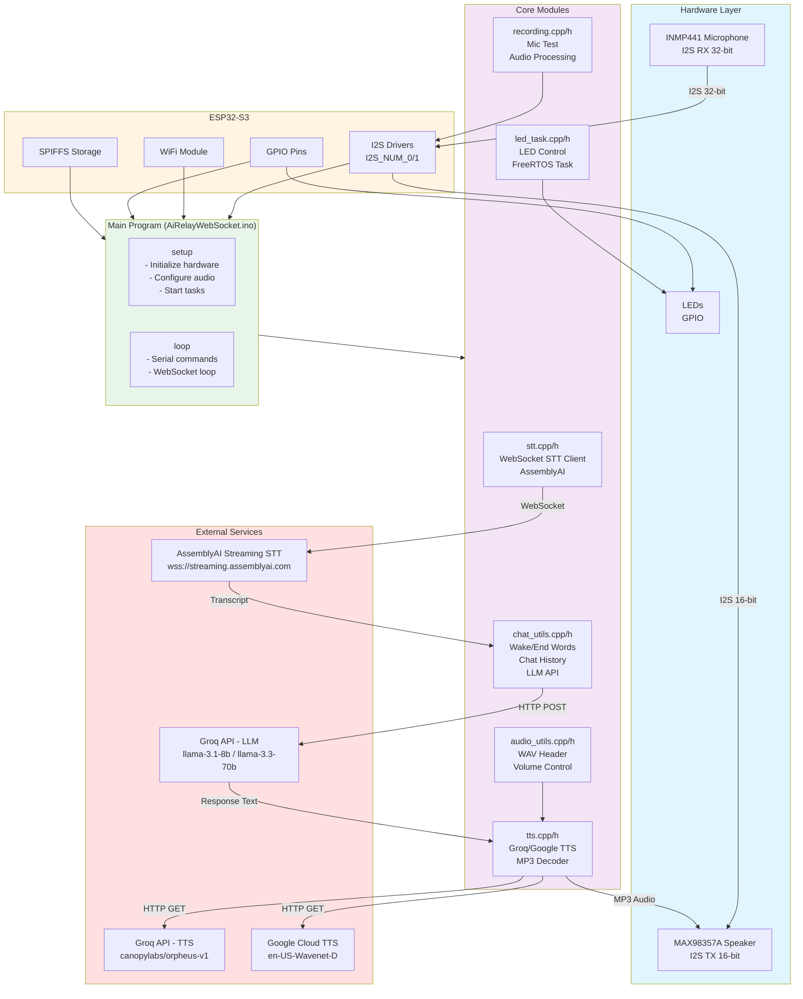
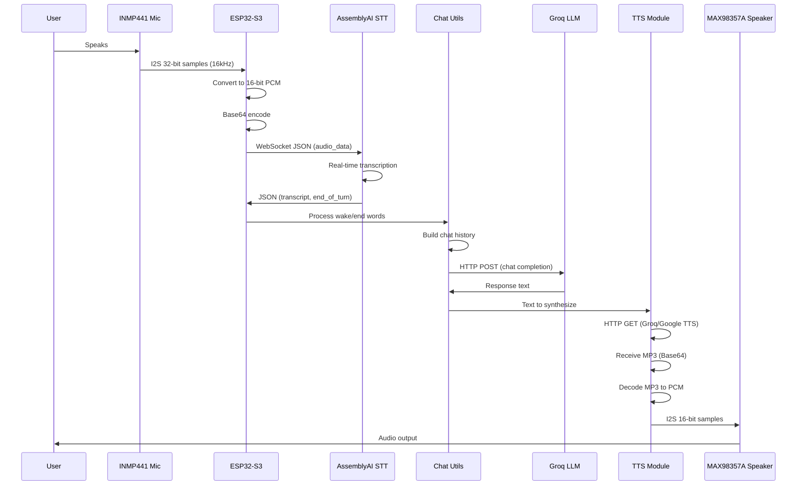

# ESP32 AI Companion - Project Architecture Diagram

## How to generate or view the diagrams

- **In Cursor/VS Code:** Install a Mermaid extension (e.g. "Markdown Preview Mermaid Support" or "Mermaid"), then open this file and use **Markdown: Open Preview** (`Ctrl+Shift+V`). Mermaid blocks will render as diagrams.
- **Online:** Copy a mermaid code block from this file (from the line that says `mermaid` to the closing triple backticks) into [Mermaid Live Editor](https://mermaid.live) and export as PNG or SVG.
- **From the command line:** Install [Mermaid CLI](https://github.com/mermaid-js/mermaid-cli) (`npm i -g @mermaid-js/mermaid-cli`), then run `mmdc -i PROJECT_DIAGRAM.md -o diagrams/` to export each Mermaid diagram to images (you’ll need to extract each block into its own `.mmd` file for best results, or use a tool that splits the file).
- **On GitHub/GitLab:** Push this repo and view `PROJECT_DIAGRAM.md` in the browser; Mermaid blocks render automatically.

The hardware wiring section uses ASCII art and tables; for a circuit schematic, use a tool like [draw.io](https://draw.io), [KiCad](https://www.kicad.org), or [Fritzing](https://fritzing.org) and follow the pin tables.

---

## Visual Architecture Diagram (Mermaid)



## Data Flow Diagram (Mermaid)



## Hardware Wiring Diagram

Physical connections: what goes to the ESP32 vs. power/ground. All GPIO and I2S pins are defined in `config.h`.

### INMP441 microphone (6 pins)

Only **3 pins** connect to the ESP32; the other **3** go to 3.3V or GND.

```
                    INMP441 (6 pins)
                    ┌─────────────┐
         SCK ───────┤ 1       6   ├─────── GND  (to ground)
      GPIO 12       │   SCK  GND  │
                    │             │
         WS  ───────┤ 3       5   ├─────── GND  (to ground)
      GPIO 13       │   WS   GND  │
                    │             │
         SD  ───────┤ 2       4   ├─────── GND  (L/R = left channel)
      GPIO 14       │   SD   L/R  │
                    │             │
                    │  (VCC on    │
                    │   breakout) │
                    └──────┬──────┘
                           │
                           └────────── 3.3V  (to 3.3V rail)
```

| Pin  | Connection   | Notes                          |
|------|--------------|---------------------------------|
| SCK  | ESP32 GPIO 12| I2S bit clock                   |
| WS   | ESP32 GPIO 13| I2S word select                |
| SD   | ESP32 GPIO 14| I2S data (mic → ESP32)          |
| L/R  | **GND**      | Left channel; 3.3V = right      |
| VCC  | **3.3V**     | Supply 1.8V–3.3V               |
| GND  | **GND**      | Ground (often 2 pins on breakout) |

---

### MAX98357A speaker (I2S amp)

**3 pins** to the ESP32; power and control go to 3.3V/5V and GND.

```
                    MAX98357A
                    ┌─────────────┐
      BCLK ─────────┤ BCLK    VIN ├──────┬──── 3.3V or 5V  (via capacitor)
      GPIO 5        │             │      │
                    │             │      └── e.g. 10µF–100µF to rail
      LRC  ─────────┤ LRC     SD ├──────────── 3.3V  (shutdown disable, always on)
      GPIO 4        │             │
                    │             │
      DIN  ─────────┤ DIN    GAIN ├──────┬──── same as VIN (3.3V or 5V)
      GPIO 6        │             │      │
                    │         GND ├──────┴──── GND
                    └─────────────┘
```

| Pin  | Connection       | Notes                              |
|------|------------------|-------------------------------------|
| BCLK | ESP32 GPIO 5     | I2S bit clock                       |
| LRC  | ESP32 GPIO 4     | I2S left/right clock                |
| DIN  | ESP32 GPIO 6      | I2S data (ESP32 → amp)              |
| VIN  | **3.3V or 5V**   | Via capacitor (e.g. 10µF–100µF)     |
| GND  | **GND**          | Ground                              |
| SD   | **3.3V**        | Shutdown disable (GND = mute)       |
| GAIN | **Same as VIN** | 3.3V or 5V (gain setting)           |

---

### LEDs (GPIO 1 and 2)

Two LEDs (e.g. red and green for recording/waiting). **Cathode (negative)** to the ESP32 pin; **anode (positive)** through a resistor to 3.3V. Active low: **LOW = on**, **HIGH = off**.

```
      3.3V ───[R]───┬─── LED 1 (e.g. Red)  anode
                    │         cathode
                    └────────────────────── GPIO 1  (PIN_RED)

      3.3V ───[R]───┬─── LED 2 (e.g. Green)  anode
                    │         cathode
                    └────────────────────── GPIO 2  (PIN_GREEN)
```

- **Resistor:** e.g. 220Ω–1kΩ (adjust for brightness and LED current).
- **Polarity:** Short leg / flat side of LED = cathode → GPIO. Long leg / round side = anode → resistor → 3.3V.

---

## System Overview

```
┌─────────────────────────────────────────────────────────────────────────┐
│                         ESP32-S3 Voice Assistant                        │
│                    (AiRelayWebSocket - Arduino Project)                  │
└─────────────────────────────────────────────────────────────────────────┘

┌─────────────────────────────────────────────────────────────────────────┐
│                              HARDWARE LAYER                              │
├─────────────────────────────────────────────────────────────────────────┤
│                                                                           │
│  ┌──────────────┐    ┌──────────────┐    ┌──────────────┐              │
│  │   INMP441    │    │  MAX98357A   │    │     LEDs     │              │
│  │  Microphone  │    │   Speaker    │    │   (GPIO)     │              │
│  │  (I2S RX)    │    │  (I2S TX)    │    │              │              │
│  └──────┬───────┘    └──────┬───────┘    └──────┬───────┘              │
│         │                   │                   │                       │
│         │ I2S               │ I2S               │ GPIO                  │
│         │ (32-bit)          │ (16-bit)          │                       │
│         │                   │                   │                       │
│  ┌──────▼───────────────────▼───────────────────▼───────┐              │
│  │              ESP32-S3 (I2S_NUM_0/1)                  │              │
│  │  ┌──────────┐  ┌──────────┐  ┌──────────┐          │              │
│  │  │   GPIO   │  │   I2S    │  │   WiFi   │          │              │
│  │  │  Pins    │  │ Drivers  │  │  Module  │          │              │
│  │  └──────────┘  └──────────┘  └──────────┘          │              │
│  │                                                      │              │
│  │  ┌──────────┐  ┌──────────┐                        │              │
│  │  │   LED    │  │  SPIFFS  │                        │              │
│  │  │  (RGB)   │  │  Storage │                        │              │
│  │  └──────────┘  └──────────┘                        │              │
│  └──────────────────────────────────────────────────────┘              │
│                                                                           │
└─────────────────────────────────────────────────────────────────────────┘

┌─────────────────────────────────────────────────────────────────────────┐
│                            SOFTWARE ARCHITECTURE                          │
├─────────────────────────────────────────────────────────────────────────┤
│                                                                           │
│  ┌─────────────────────────────────────────────────────────────────┐   │
│  │                    MAIN PROGRAM (AiRelayWebSocket.ino)          │   │
│  │  ┌───────────────────────────────────────────────────────────┐  │   │
│  │  │  setup()                                                   │  │   │
│  │  │  - Initialize SPIFFS, WiFi, I2S, WebSocket                │  │   │
│  │  │  - Configure audio (mic: 32-bit, speaker: 16-bit)         │  │   │
│  │  │  - Start LED task                                         │  │   │
│  │  └───────────────────────────────────────────────────────────┘  │   │
│  │  ┌───────────────────────────────────────────────────────────┐  │   │
│  │  │  loop()                                                    │  │   │
│  │  │  - Serial commands, WebSocket loop                       │  │   │
│  │  │  - Process serial commands (TTS test, volume, etc.)       │  │   │
│  │  │  - WebSocket loop                                         │  │   │
│  │  │  - Stream microphone frames                               │  │   │
│  │  │  - Handle mic test mode                                   │  │   │
│  │  └───────────────────────────────────────────────────────────┘  │   │
│  └─────────────────────────────────────────────────────────────────┘   │
│                                                                           │
│  ┌─────────────────────────────────────────────────────────────────┐   │
│  │                         CORE MODULES                             │   │
│  ├─────────────────────────────────────────────────────────────────┤   │
│  │                                                                   │   │
│  │  ┌──────────────┐  ┌──────────────┐  ┌──────────────┐         │   │
│  │  │   stt.cpp    │  │   tts.cpp    │  │ recording.cpp│         │   │
│  │  │   stt.h      │  │   tts.h      │  │ recording.h  │         │   │
│  │  ├──────────────┤  ├──────────────┤  ├──────────────┤         │   │
│  │  │ WebSocket    │  │ Groq TTS     │  │ Mic Test     │         │   │
│  │  │ STT Client   │  │ Google TTS   │  │ Audio Proc   │         │   │
│  │  │ (AssemblyAI) │  │ MP3 Decoder  │  │              │         │   │
│  │  │              │  │ Base64 Decode│  │              │         │   │
│  │  └──────┬───────┘  └──────┬───────┘  └──────┬───────┘         │   │
│  │         │                 │                  │                  │   │
│  │  ┌──────▼─────────────────▼──────────────────▼───────┐        │   │
│  │  │            chat_utils.cpp / chat_utils.h          │        │   │
│  │  │  - Wake/end word processing                       │        │   │
│  │  │  - Chat history management                        │        │   │
│  │  │  - LLM API calls (Groq)                          │        │   │
│  │  └───────────────────────────────────────────────────┘        │   │
│  │                                                                   │   │
│  │  ┌──────────────┐  ┌──────────────┐  ┌──────────────┐         │   │
│  │  │ audio_utils  │  │  led_task    │  │   config.h    │         │   │
│  │  │              │  │              │  │   globals.h   │         │   │
│  │  │ WAV Header   │  │ LED Control  │  │   prompts.h  │         │   │
│  │  │ Volume Ctrl  │  │ (FreeRTOS)   │  │   secrets.h  │         │   │
│  │  │ Format Conv  │  │              │  │              │         │   │
│  │  └──────────────┘  └──────────────┘  └──────────────┘         │   │
│  │                                                                   │   │
│  └─────────────────────────────────────────────────────────────────┘   │
│                                                                           │
└─────────────────────────────────────────────────────────────────────────┘

┌─────────────────────────────────────────────────────────────────────────┐
│                          DATA FLOW DIAGRAM                               │
├─────────────────────────────────────────────────────────────────────────┤
│                                                                           │
│  ┌─────────────┐                                                         │
│  │  Microphone │                                                         │
│  │  (INMP441)  │                                                         │
│  └──────┬──────┘                                                         │
│         │                                                                 │
│         │ I2S 32-bit samples                                             │
│         │ 16kHz, mono                                                    │
│         ▼                                                                 │
│  ┌─────────────────────────────────────────────────────────────┐       │
│  │  streamMicFrame()                                            │       │
│  │  - Read I2S buffer (32-bit)                                  │       │
│  │  - Convert to 16-bit PCM                                     │       │
│  │  - Base64 encode                                             │       │
│  └──────┬──────────────────────────────────────────────────────┘       │
│         │                                                                 │
│         │ WebSocket (SSL)                                                │
│         │ JSON: {"audio_data": "base64..."}                              │
│         ▼                                                                 │
│  ┌─────────────────────────────────────────────────────────────┐       │
│  │  AssemblyAI Streaming STT                                    │       │
│  │  (streaming.assemblyai.com:443)                              │       │
│  │  - Real-time transcription                                    │       │
│  │  - Turn detection                                            │       │
│  │  - Language detection                                        │       │
│  └──────┬──────────────────────────────────────────────────────┘       │
│         │                                                                 │
│         │ WebSocket JSON Response                                        │
│         │ {"type": "Turn", "transcript": "...", "end_of_turn": true}    │
│         ▼                                                                 │
│  ┌─────────────────────────────────────────────────────────────┐       │
│  │  handleWsTextMessage()                                       │       │
│  │  - Parse JSON                                                │       │
│  │  - Extract final transcript                                  │       │
│  │  - Process wake/end words                                    │       │
│  └──────┬──────────────────────────────────────────────────────┘       │
│         │                                                                 │
│         │ Processed text                                                  │
│         ▼                                                                 │
│  ┌─────────────────────────────────────────────────────────────┐       │
│  │  getChatResponse()                                           │       │
│  │  - Build chat history                                        │       │
│  │  - HTTP POST to Groq API                                     │       │
│  │  - Model: llama-3.1-8b-instant or llama-3.3-70b-versatile   │       │
│  └──────┬──────────────────────────────────────────────────────┘       │
│         │                                                                 │
│         │ LLM Response Text                                               │
│         ▼                                                                 │
│  ┌─────────────────────────────────────────────────────────────┐       │
│  │  speakGroqTTS() or speakGoogleTTS()                          │       │
│  │  ┌────────────────────┐  ┌────────────────────┐            │       │
│  │  │   Groq TTS API     │  │  Google Cloud TTS  │            │       │
│  │  │  (Base64 MP3)      │  │  (MP3 stream)      │            │       │
│  │  └────────┬───────────┘  └────────┬───────────┘            │       │
│  │           │                        │                         │       │
│  │           └──────────┬─────────────┘                         │       │
│  │                      │                                        │       │
│  │                      │ Base64 MP3 / MP3 stream               │       │
│  │                      ▼                                        │       │
│  │            ┌──────────────────────┐                          │       │
│  │            │  streamDecodeAndPlay()│                          │       │
│  │            │  - Base64 decode      │                          │       │
│  │            │  - MP3 decode (DAZI) │                          │       │
│  │            │  - Volume control     │                          │       │
│  │            └───────────┬──────────┘                          │       │
│  └────────────────────────┼──────────────────────────────────────┘       │
│                           │                                               │
│                           │ PCM 16-bit samples                            │
│                           │ 16kHz, mono                                   │
│                           ▼                                               │
│                  ┌─────────────────┐                                      │
│                  │  I2S Speaker   │                                      │
│                  │  (MAX98357A)   │                                      │
│                  └─────────────────┘                                      │
│                                                                           │
└─────────────────────────────────────────────────────────────────────────┘

┌─────────────────────────────────────────────────────────────────────────┐
│                         EXTERNAL SERVICES                                │
├─────────────────────────────────────────────────────────────────────────┤
│                                                                           │
│  ┌──────────────────────────────────────────────────────────────┐      │
│  │  AssemblyAI Streaming STT                                     │      │
│  │  - WebSocket: wss://streaming.assemblyai.com:443             │      │
│  │  - Real-time speech-to-text                                  │      │
│  │  - Turn detection & language detection                        │      │
│  └──────────────────────────────────────────────────────────────┘      │
│                                                                           │
│  ┌──────────────────────────────────────────────────────────────┐      │
│  │  Groq API                                                     │      │
│  │  - LLM: api.groq.com/openai/v1/chat/completions             │      │
│  │    • llama-3.1-8b-instant (fast)                            │      │
│  │    • llama-3.3-70b-versatile (advanced)                     │      │
│  │  - TTS: api.groq.com/openai/v1/audio/speech                 │      │
│  │    • canopylabs/orpheus-v1-english                          │      │
│  └──────────────────────────────────────────────────────────────┘      │
│                                                                           │
│  ┌──────────────────────────────────────────────────────────────┐      │
│  │  Google Cloud TTS                                             │      │
│  │  - texttospeech.googleapis.com/v1/text:synthesize           │      │
│  │  - Voice: en-US-Wavenet-D                                    │      │
│  └──────────────────────────────────────────────────────────────┘      │
│                                                                           │
└─────────────────────────────────────────────────────────────────────────┘

┌─────────────────────────────────────────────────────────────────────────┐
│                         KEY FEATURES                                     │
├─────────────────────────────────────────────────────────────────────────┤
│                                                                           │
│  ✓ Real-time streaming STT (AssemblyAI WebSocket)                        │
│  ✓ Wake word / End word support (configurable)                           │
│  ✓ Dual LLM models (8B fast / 70B advanced)                              │
│  ✓ Dual TTS providers (Groq / Google Cloud)                              │
│  ✓ Chat history management (8 message context)                           │
│  ✓ LED status indicators (recording/waiting)                              │
│  ✓ Serial commands (toggle listening, clear history, etc.)                  │
│  ✓ Mic test mode (direct mic-to-speaker passthrough)                     │
│  ✓ Serial command interface (volume, sensitivity, etc.)                  │
│  ✓ Audio calibration (volume, mic threshold, gain)                       │
│                                                                           │
└─────────────────────────────────────────────────────────────────────────┘

┌─────────────────────────────────────────────────────────────────────────┐
│                         CONFIGURATION                                    │
├─────────────────────────────────────────────────────────────────────────┤
│                                                                           │
│  Hardware Pins (config.h):                                               │
│  - Speaker: BCLK=5, LRC=4, DIN=6                                         │
│  - Microphone: SCK=12, WS=13, SD=14                                      │
│  - LEDs: RED=1, GREEN=2                                                  │
│                                                                           │
│  Hardware wiring (connect as follows):                                   │
│                                                                           │
│  INMP441 microphone:                                                     │
│  │ INMP441 Pin │ ESP32 / Other  │ Notes                                  │
│  │ SCK         │ GPIO 12        │ I2S bit clock                          │
│  │ WS          │ GPIO 13        │ I2S word select (L/R clock)            │
│  │ SD          │ GPIO 14        │ I2S data output (mic → ESP32)           │
│  │ L/R         │ GND            │ Left channel (L/R low). Use 3.3V for   │
│  │             │               │ right channel; do not leave floating.   │
│  │ VCC / 3V3   │ 3.3V           │ 1.8V–3.3V supply                       │
│  │ GND         │ GND            │                                          │
│                                                                           │
│  MAX98357A speaker:                                                      │
│  │ BCLK, LRC, DIN → GPIO 5, 4, 6. VIN → 3.3V or 5V via capacitor.       │
│  │ SD → 3.3V. GAIN → same as VIN (3.3V or 5V). GND → GND.               │
│                                                                           │
│  LEDs (cathode to ESP32, anode via resistor to 3.3V; active low):         │
│  │ LED 1 (e.g. red)  : cathode → GPIO 1, anode → [R] → 3.3V            │
│  │ LED 2 (e.g. green): cathode → GPIO 2, anode → [R] → 3.3V            │
│                                                                           │
│  Audio Settings:                                                         │
│  - Sample Rate: 16kHz                                                     │
│  - Mic: 32-bit I2S (INMP441 requirement)                                │
│  - Speaker: 16-bit I2S                                                   │
│  - Frame Size: 200ms (3200 samples)                                      │
│                                                                           │
│  Timing:                                                                  │
│  - WebSocket keepalive: 30s                                              │
│  - WebSocket reconnect: 60s                                               │
│                                                                           │
└─────────────────────────────────────────────────────────────────────────┘

┌─────────────────────────────────────────────────────────────────────────┐
│                         DEPENDENCIES                                     │
├─────────────────────────────────────────────────────────────────────────┤
│                                                                           │
│  Arduino Libraries:                                                      │
│  - WiFi (ESP32)                                                          │
│  - WiFiClientSecure (ESP32)                                              │
│  - HTTPClient (ESP32)                                                    │
│  - WebSocketsClient (by Markus Sattler)                                 │
│  - ArduinoJson (by Benoit Blanchon)                                      │
│  - SPIFFS (ESP32)                                                        │
│                                                                           │
│  External Library:                                                       │
│  - DAZI-AI-main (MP3 decoder, included in project)                      │
│                                                                           │
└─────────────────────────────────────────────────────────────────────────┘

## File Structure Diagram

```
AiRelayWebSocket/
│
├── AiRelayWebSocket.ino          # Main program (setup/loop)
│
├── Core Modules:
│   ├── stt.cpp/h                 # Speech-to-Text (WebSocket STT client)
│   ├── tts.cpp/h                 # Text-to-Speech (Groq/Google TTS)
│   ├── recording.cpp/h           # Audio recording & mic test
│   ├── chat_utils.cpp/h          # LLM chat, wake words, history
│   ├── audio_utils.cpp/h         # Audio utilities (WAV, volume)
│   └── led_task.cpp/h            # LED control task (FreeRTOS)
│
├── Configuration:
│   ├── config.h                  # Hardware pins, audio settings
│   ├── globals.h                 # Global variables & structs
│   ├── prompts.h                 # System prompts for LLM
│   ├── secrets.h                 # API keys (not in repo)
│   └── secrets_example.h         # Template for secrets.h
│
└── External Library:
    └── DAZI-AI-main/             # MP3 decoder library
        ├── src/
        │   ├── mp3_decoder/      # MP3 decoding
        │   ├── aac_decoder/      # AAC decoding
        │   ├── flac_decoder/     # FLAC decoding
        │   ├── opus_decoder/     # Opus decoding
        │   ├── vorbis_decoder/   # Vorbis decoding
        │   ├── Audio.cpp/h       # Audio playback
        │   └── I2SAudioPlayer.cpp/h
        └── examples/             # Example sketches
```

## Module Dependencies

```
AiRelayWebSocket.ino
    ├── config.h
    ├── globals.h
    ├── secrets.h
    ├── prompts.h
    │
    ├── audio_utils.h ────────────┐
    ├── chat_utils.h ─────────────┤
    ├── tts.h ────────────────────┤
    ├── stt.h ────────────────────┤
    ├── recording.h ──────────────┤
    └── led_task.h ───────────────┤
                                   │
        (All modules depend on:)   │
        ├── config.h ─────────────┘
        ├── globals.h ─────────────┘
        └── Arduino libraries
            ├── WiFi
            ├── WiFiClientSecure
            ├── HTTPClient
            ├── WebSocketsClient
            ├── ArduinoJson
            └── SPIFFS
```