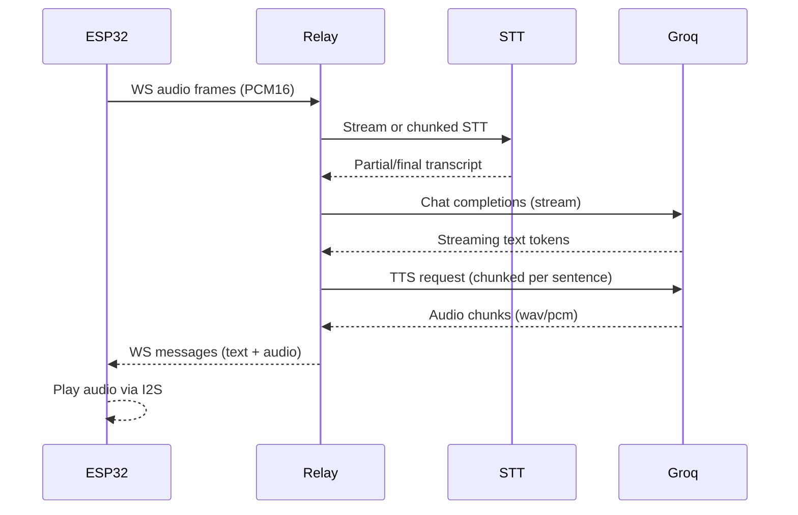

# Realtime ESP32 Chatbot Plan

## Goals

- Always-on voice dialog with lower latency than record/upload/download.
- WebSocket transport between ESP32 and a lightweight relay; Groq as LLM/TTS provider.
- Reuse your existing audio I2S pipeline and JSON handling.

## Proposed Architecture

Because Groq does not expose a native WebSocket endpoint, we’ll add a small relay that:

- Accepts ESP32 WebSocket audio frames
- Performs ASR (free) and/or forwards to Groq LLM
- Streams text + TTS audio back over WebSocket to ESP32

### Data flow (planned)

## Key repo files to reference

- `[Arduino/AIRelay/chat_asr/chat_asr.ino](Arduino/AIRelay/chat_asr/chat_asr.ino)` — current working audio + Groq HTTP pipeline
- `[Arduino/AIRelay/DAZI-AI-main.zip](Arduino/AIRelay/DAZI-AI-main.zip)` — reference for WebSocket streaming patterns and realtime dialog structure
- (New) `AiRelayWebSocket.ino` (to be created or updated in repo root if that is your preferred location)

## Design Decisions

- **WebSocket layer:** Use a WebSocket client library on ESP32 to stream PCM16 in 20–40 ms frames.
- **Always-on mode:** Voice activity detection on device to trigger streaming sessions.
- **Groq integration:** Use Groq for LLM/TTS via HTTP streaming in relay; ESP32 only talks WebSocket.
- **Conversation state:** Maintain history on relay to minimize ESP32 memory load.

## Implementation Outline

1. **ESP32 client (Arduino)**
  - Add WebSocket client dependency (e.g., `WebSocketsClient`).
  - Implement I2S mic stream loop with VAD and frame batching.
  - Encode frames (binary) and send via WebSocket.
  - Handle incoming WS messages: text events + audio chunks; feed audio to I2S output.
  - Reuse existing I2S mic/speaker config from `chat_asr.ino`.
2. **Relay server (new, minimal)**
  - Provide WS endpoint for ESP32.
  - STT service (free): choose a provider or local open-source engine.
  - Call Groq chat completion with streaming enabled.
  - Chunk TTS requests on sentence boundaries and stream audio back to ESP32.
  - Define a small WS protocol: `event`, `seq`, `payload`.
3. **Protocol definition (WS)**
  - `audio`: binary PCM16 frames
  - `asr_partial` / `asr_final`: text updates
  - `llm_token`: streaming text
  - `tts_audio`: audio bytes with format metadata
  - `session_end`: end of reply

## Open Items to confirm in code phase

- Which STT provider or local model you want for “free” (Whisper.cpp on relay is a common choice).
- ESP32 memory budget for buffering audio.
- Whether to keep using SPIFFS or direct I2S stream only.

## Files likely to change or add

- Update `[Arduino/AIRelay/chat_asr/chat_asr.ino](Arduino/AIRelay/chat_asr/chat_asr.ino)` or create `AiRelayWebSocket.ino` in repo root
- Add new relay folder (e.g., `relay/`) with minimal WebSocket server
- Add docs/update `[README.txt](README.txt)` with setup and API keys

